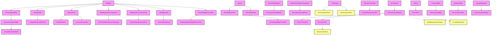

```mermaid

graph TD
    UObject --> UGameplayAbility
    UGameplayAbility --> UAuraGameplayAbility
    UAuraGameplayAbility --> UAuraProjectileSpell
    
    UObject --> UAbilityTask
    UAbilityTask --> UTargetDataUnderMouse
    
    UObject --> UDataAsset
    UDataAsset --> UAttributeInfo
    UDataAsset --> UAuraInputConfig
    
    UObject --> UAbilitySystemComponent
    UAbilitySystemComponent --> UAuraAbilitySystemComponent
    
    UObject --> UBlueprintFunctionLibrary
    UBlueprintFunctionLibrary --> UAuraAbilitySystemLibrary
    
    UObject --> UAttributeSet
    UAttributeSet --> UAuraAttributeSet
    
    AActor --> AAuraEffectActor
    AActor --> AAuraProjectile
    
    ACharacter --> AAuraCharacterBase
    AAuraCharacterBase --> AAuraCharacter
    AAuraCharacterBase --> AAuraEnemy
    
    AGameModeBase --> AAuraGameModeBase
    
    UEnhancedInputComponent --> UAuraInputComponent
    
    UInterface --> UCombatInterface
    UInterface --> UEnemyInterface
    
    APlayerController --> AAuraPlayerController
    
    APlayerState --> AAuraPlayerState
    
    AHUD --> AAuraHUD
    
    UUserWidget --> UAuraUserWidget
    
    UObject --> UAuraWidgetController
    UAuraWidgetController --> UAttributeMenuWidgetController
    UAuraWidgetController --> UOverlayWidgetController
    
    UAssetManager --> UAuraAssetManager
    
    AAuraCharacterBase -.-> IAbilitySystemInterface
    AAuraCharacterBase -.-> ICombatInterface
    AAuraEnemy -.-> IEnemyInterface
    AAuraPlayerState -.-> IAbilitySystemInterface

    classDef default fill:#f9f,stroke:#333,stroke-width:2px;
    classDef interface fill:#ff9,stroke:#333,stroke-width:2px;
    class UCombatInterface,UEnemyInterface,ICombatInterface,IEnemyInterface,IAbilitySystemInterface interface;

```
